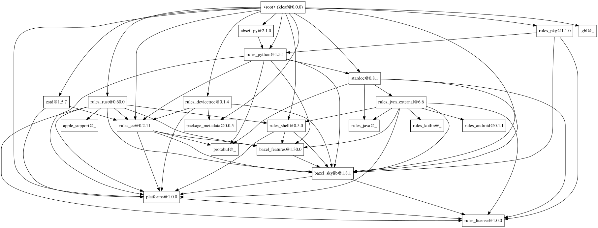

1.  Update Bazel to your desired version.

    ```sh
    prebuilts/kernel-build-tools/update-bazel.sh 8.7.0
    ```

2.  Update the registry. Googlers: See go/kleaf-update-bcr.

3.  Temporarily delete all `local_path_override()` in the top-level MODULE.bazel
    file.

4.  Run the following. Note that it likely fails on several extensions; most
    are KI.

    ```sh
    bazel mod graph --config=internet --output graph | dot -Tsvg > /tmp/graph.svg
    ```

    The resulting image looks like

    

5.  Revert step #3.

6.  Examine the graph from bottom to the top, i.e. do a reverse topological
    sort. Update them to at least the given version in the reverse topological
    sort order.

    In the example image, `rules_license` needs to be updated to
    `1.0.0` or above, then `platforms` to `1.0.0` or above, then `bazel-skylib`
    to `1.8.1` or above, and so on.

    Also update the corresponding versions in top-level `MODULE.bazel`.

    For modules that are a direct dependency of `@kleaf` (See top-level
    `MODULE.bazel`), it is recommended to update the module to the latest, not
    just to the version in the graph. If you do so, make sure to update
    `MODULE.bazel` and refresh the graph as you go, because newer
    versions could introduce new dependencies.

7.  Finally, commit the update for the `bazel` binary in step #1.
